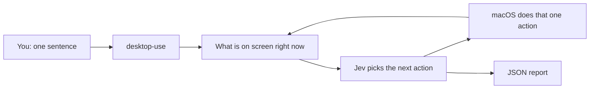
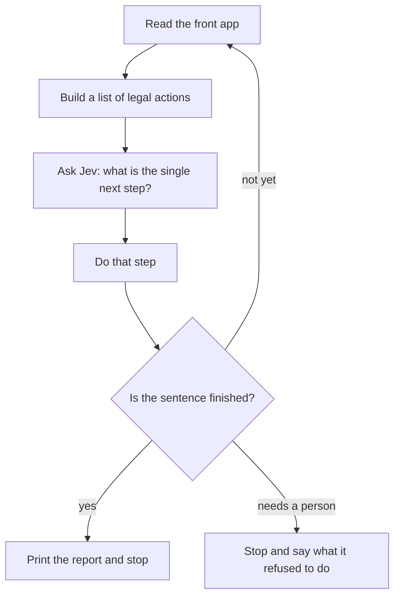
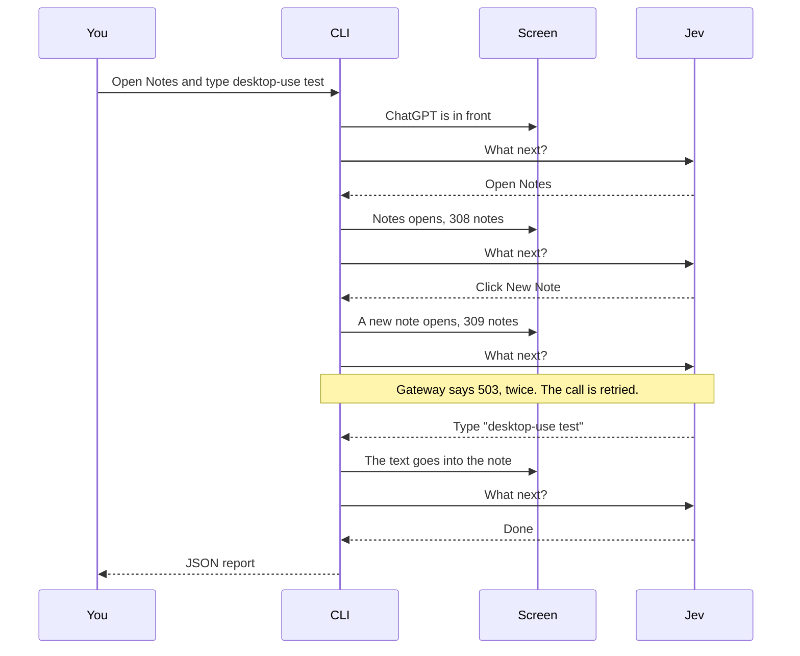

# How the CLI works

`desktop-use` is a terminal command. You give it one sentence. It looks at the app in front of you, does the next click or keystroke, looks again, and repeats until the sentence is finished. Then it prints a short JSON report.

It does not see the screen as a picture. macOS already exposes buttons, text fields, and menus through Accessibility. The command reads that list.



Jev never types AppleScript and never invents a click coordinate. It chooses from the list the command just built. The Swift program is what actually opens the app, clicks, or types.

## One lap around the loop

Each lap is one small decision.



Jev answers several questions in that one call: which kind of action, which button or field, which words to type, and whether this step finishes the sentence. Those questions travel together. The command still does only one action afterward.

If Vercel replies that it is temporarily unavailable, the same call is sent again. The screen is not clicked a second time for that retry.

## What the command will not do by itself

Opening, scrolling, and typing a draft run on their own. Sending, posting, deleting, paying, publishing, and quitting stop first. The report then says `needs_confirmation`. Run the same sentence again with `--approve` only after you agree.

`--allow Notes` means Notes is the only app it may touch.

## The Notes example

This is the command that was run:

```bash
desktop-use run --allow Notes --goal "Open Notes and type desktop-use test"
```

ChatGPT was the front app. The command was allowed to touch Notes only.



What each lap saw:

| Lap | On screen | Jev chose | What changed |
| --- | --- | --- | --- |
| 1 | ChatGPT | Open Notes | Notes came to the front. The window title was "Notes – 308 notes". |
| 2 | Notes | Click New Note | A note was created. The title became "Notes – 309 notes". |
| 3 | The new note | Type `desktop-use test` | That phrase was entered in the note. The gateway was briefly unavailable and the question was asked again before this happened. |
| 4 | The note, with the text in it | Done | Nothing else was clicked. |

The phrase was still in that note afterward.

## What it returned

The command prints one JSON object. This is the real result, shortened only in spacing:

```json
{
  "status": "done",
  "summary": "Typed into text entry area in Notes – 309 notes ('desktop-use test')",
  "application": "Notes",
  "window": "Notes – 309 notes",
  "decisionSeconds": 7.32,
  "actions": [
    {
      "operation": "OPEN_APP",
      "target": "Open Notes",
      "result": "Launch requested: Open Notes → window is now 'Notes – 308 notes'"
    },
    {
      "operation": "CLICK",
      "target": "New Note",
      "result": "Action sent: New Note → window is now 'Notes – 309 notes'"
    },
    {
      "operation": "TYPE_TEXT",
      "target": "Focus text entry area in Notes – 309 notes",
      "result": "Typed into text entry area in Notes – 309 notes ('desktop-use test')"
    }
  ]
}
```

How to read it:

- `status` is `done`. The sentence was finished. Exit code 0.
- `summary` is the last thing that happened, in one line.
- `application` and `window` are where it stopped.
- `decisionSeconds` is time spent waiting for Jev, including the retries. Looking at the screen and clicking are extra.
- `actions` is the diary. Three steps ran. "Done" is not an action, so it is not in the list.

Other statuses you can get:

| status | Meaning |
| --- | --- |
| `done` | The sentence is finished. |
| `needs_confirmation` | The next step would send, delete, pay, publish, or quit. It was not done. |
| `unclear` | Two targets looked equally likely. It stopped and named them. |
| `blocked` | Nothing on screen could continue. |
| `error` | Setup or the network failed. `actions` still lists any steps that already happened. |
