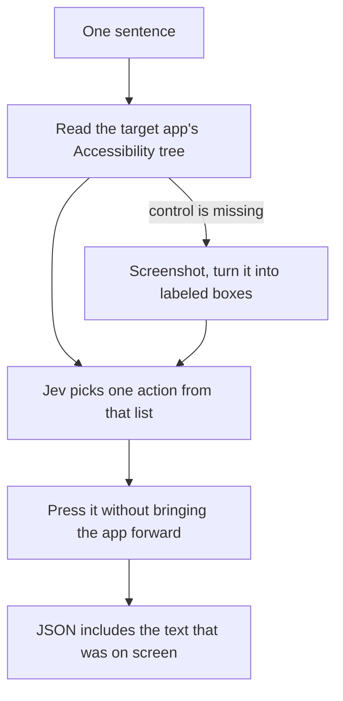

# Closer to Codex

Codex computer use on the Mac reads the same Accessibility tree this command already reads. It then presses the control in the app that is already open, and it leaves your front window alone. It also comes back with what the screen said. Screenshots are only for controls the tree does not contain.

`desktop-use` already has the local loop and Jev. These three changes are what it is missing. AppleScript stays out. It adds nothing for Cursor, Codex, WhatsApp, Teams, or a web page, and Excel and PowerPoint are a separate document-scripting idea, not this plan.

Do them in this order. Each one is useful on its own.

## 1. Leave the front window alone

Today `Desktop.perform` activates the target whenever it is not already in front (`Desktop.swift`, around the `activate()` call before the action). `press(key:)` does the same. Opening an app or a URL still uses `NSWorkspace.OpenConfiguration` with `activates = true`, which is correct for a launch. A click on an app that is already open should not steal the screen.

Change the click path first. `AXPress` on a control in a background app is the action to try. If that press changes the target window, stop there. If it does not land, activate and retry once. Typing and some Electron controls still need the app to be active. That retry is the exception, not the normal path.

Opening an app, quitting, and arranging windows may still change focus. Those actions are about which window is in front.

Done when a click in an already-open app leaves the user's front window in front, and a control that ignores a background press still gets the one retry.

## 2. Return the text that was on screen

Jev does not write the summary. `Runner.swift` builds `RunReport` from action templates: operation, target label, and a line like "Action sent". While `offer()` builds the choice list it already has each control's label and value. That text is sent to Jev and then dropped. The Maps run could only report that it pressed Reviews, Sort, and Newest.

Add one field to the JSON, a short `observed` string. Fill it from the labels and values already collected for the target window, kept to the text that relates to the goal and to the control that was just used. Cap it. The full tree still does not go into the report or the chat.

The summary stays a deterministic template. `observed` is the screen text, copied, not a sentence Jev composed.

Done when a run that opens a list, a note, or a review panel returns the visible words in `observed`, and a run that only presses a button still says which button in `summary`.

## 3. Screenshot only when the tree has no control

Jev cannot look at a picture. It can only pick from a list. Codex uses a screenshot when Accessibility never exposes the control. The Maps review cards were in that situation: the Reviews button was in the tree, and the review bodies were not.

When the goal still needs a control that is not in the list, capture the target window, turn the picture into labeled boxes, and offer those boxes to Jev as ordinary click targets. The same confirmation rules apply. A box labeled Send still stops without `--approve`.

Quoting a paragraph out of the pixels is not this step. That needs a model that can read an image. Jev will not grow that ability here. If the boxes have no words, `observed` stays empty and the report says the text was not available to Accessibility.

This step needs Screen Recording permission for the installed binary, separate from Accessibility. Skip the screenshot when the tree already contains a matching control.

Done when a control missing from the tree can be clicked as a box Jev chose, and a normal Notes or Finder task never takes a screenshot.

## What stays the same

Jev still picks one action from a closed list. It still does not emit AppleScript, shell, or a raw coordinate. Send, post, delete, pay, publish, and quit still stop unless the run was started with `--approve`. `--allow` still limits the apps. The loop is still one local process, one goal, then JSON on stdout.
